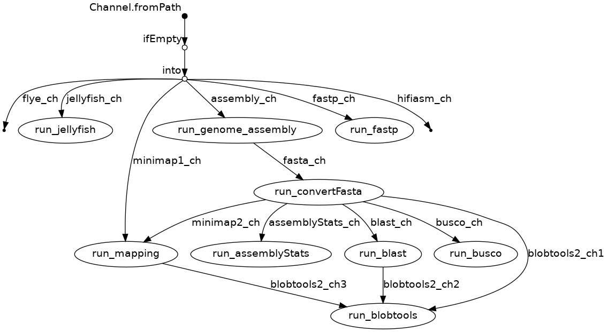

.. Wormpipe documentation master file, created by
   sphinx-quickstart on Fri May  7 23:29:04 2021.
   You can adapt this file completely to your liking, but it should at least
   contain the root `toctree` directive.

Welcome to WORMpipe's documentation!
====================================

WORMpipe is a genome analysis pipeline for:
--------------------------------------------

-  Quality control of hifi DNA sequence reads
-  Estimation of major genome features such as size, repetitiveness,
   heterozygosity
-  De novo genome assembly using either flye or Hifiasm
-  Assessment of assembly metrics such as N50 contig
-  Interrogation of assembly contamination and decontamination
-  BUSCO assessment of draft genome assemblies
-  Draft assembly scaffolding exploiting Hi-C data
-  Genome annotation

.. toctree::
   :maxdepth: 2
   :caption: Contents:

   Installation
   Input
   Execution
   Output

Pipeline flow chart
-------------------

Run the pipeline with default hifiasm mode
------------------------------------------

``nextflow run WORMpipe.nf -c WORMpipe.config --reads 312-11_deduplicated.ccs.fastq --assembler hifiasm``

For help
--------

``nextflow run WORMpipe.nf -help``

To restart the run from the last successful steps with flye assembly mode
-------------------------------------------------------------------------

``nextflow run WORMpipe.nf -c WORMpipe.config --reads 312-11_deduplicated.ccs.fastq --assembler --flye -resume``

Indices and tables
==================

* :ref:`genindex`
* :ref:`modindex`
* :ref:`search`
